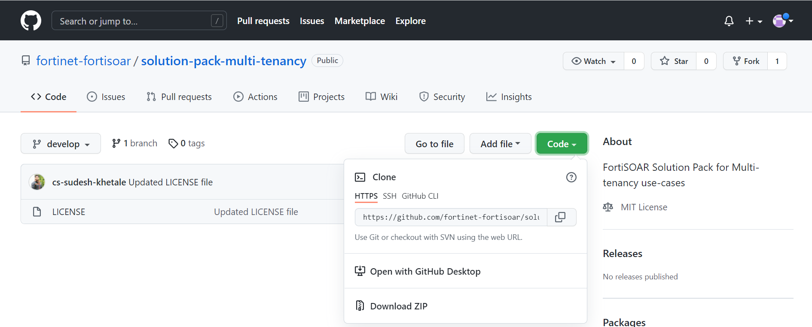
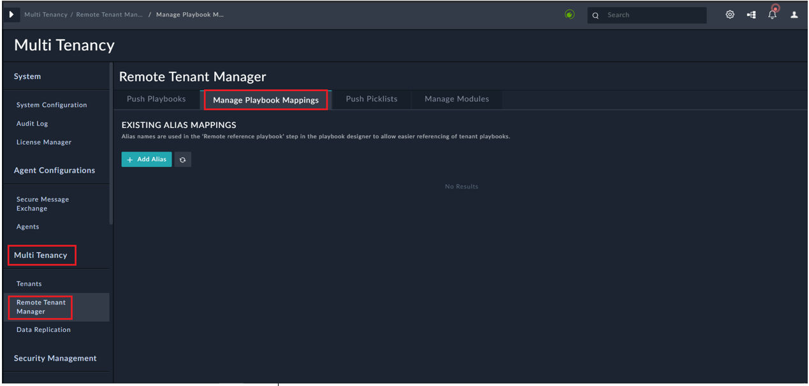
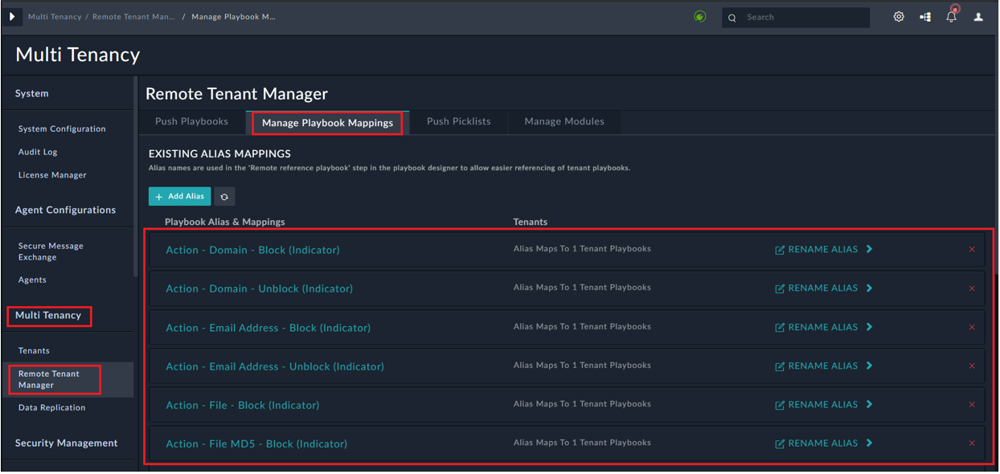
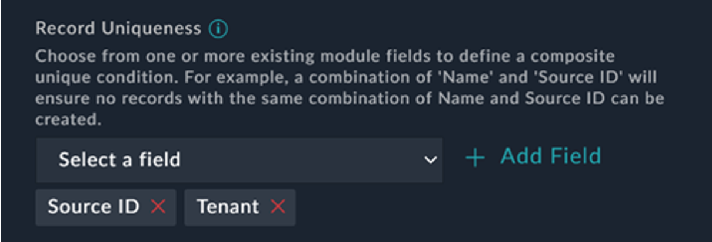

# Multi-tenancy Incident Response Solution Pack 7.0.2

## Overview

This article describes the FortiSOAR™ Incident Response Solution Pack (solution-pack-multi-tenancy) for Managed Security Service Providers (MSSPs). This solution pack enables users to experience the power and capability of FortiSOAR™ incident response in a multi-tenant architecture.

FortiSOAR™ is built using modular architecture and the FortiSOAR™ Incident Response Solution Pack is the implementation of the best practices to configure and use FortiSOAR™ in an optimal manner. The FortiSOAR™ Incident Response Solution Pack also contains a lot of sample/simulation/training data that enables you to experience FortiSOAR™ without having all the devices.

## Deploying MSSP IR Solution Pack

**Important**: Before you deploy the solution pack, ensure that you have installed FortiSOAR™ and there are no records such as alerts, indicators, incidents, etc., in your FortiSOAR™ system.

Use the following procedure as a *root* user to deploy the solution pack:

1. Log onto the Solution Pack GIT repo ([https://github.com/fortinet-fortisoar/solution-pack-multi-tenancy](https://github.com/fortinet-fortisoar/solution-pack-multi-tenancy)) using your credentials.
2. Click the **Code** button and select the **Download ZIP** option.
   
3. Log into your FortiSOAR instance, and on the left-navigation, click **Import Wizard**.
   
4. On the `Import Wizard` page, click **Import From File** and selected the solution pack zip that you have downloaded, and navigate through the Import Wizard.
   
   **Note**: It is recommended not the change any configurations or options of the imported solution pack zip file.

5. Once the import is successfully completed, you can use the MSSP IR solution pack.

Once you have completed installing the MSSP IR Solution pack Pack, you can choose to import other Solution Packs (using the same steps mentioned above) based on your requirements:

- solution-pack-mitre-attack
- solution-pack-symantec-solutions
- solution-pack-knowledge-base
- solution-pack-knowledge-base
- solution-pack-soc-simulator

## Configuring MSSP IR Solution Pack

1. Enable the remote execution flag for all the playbooks in *05-Actions* collection on the Tenant systems by executing the “Enable Remote Execution Flag(Tenant Only)” playbook as follows:
    1. Open the FortiSOAR instance,and from the navigation panel, click the **Alerts** module.
    2. Click **Execute** and then select **Enable Remote Execution Flag (Tenant Only)**.
       **Important**: Before you execute the “Enable Remote Execution Flag (Tenant Only)” playbook, ensure that there is no “Playbook Mappings” in “Remote Tenant Manager” under “Multitenancy Section” on the Master node. 
       
       After the “Enable Remote Execution Flag (Tenant Only)” playbook is executed,
       you will notice that “Playbook Mappings” is added in “Remote Tenant Manager”
       under “Multitenancy Section” on the Master node.
       
2. Map Aliases of remote actions playbooks on the Master node by executing the “Remote Alias Mapping (MasterOnly)” playbook as follows:
    1. From the navigation panel,click the **Alerts** module.
    2. Click **Execute** and then select **RemoteAlias Mapping (Master Only)**.

3.    Click **System Settings** and in the “Application Editor” section, click **Modules** to modify the record uniqueness in the mmd for various modules as follows:
      1.    For the Alerts and Incidents modules, add `SourceID` and `Tenant` fields in the “Record Uniqueness” section.
            
      2. For the Indicator module, add `Type`, `Value`, and `Tenant` fields in the “Record Uniqueness” section.
             
      3. For the SLA module, add `Severity` and `Tenant` fields in the “Record Uniqueness” section.
             
4. Disable SLA Playbooks from the *08 - Case Management* collection on the Tenant (“SLA” keyword). This is required because, SLA operations on all records, i.e. records of Master or Tenant, get performed on the Master only.
      
5. Define Tenant SLA by adding SLA records for the Tenant in the “SLA Templates” module on the Master.
      